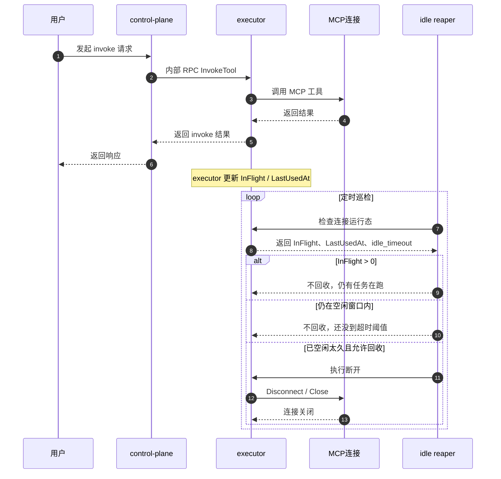
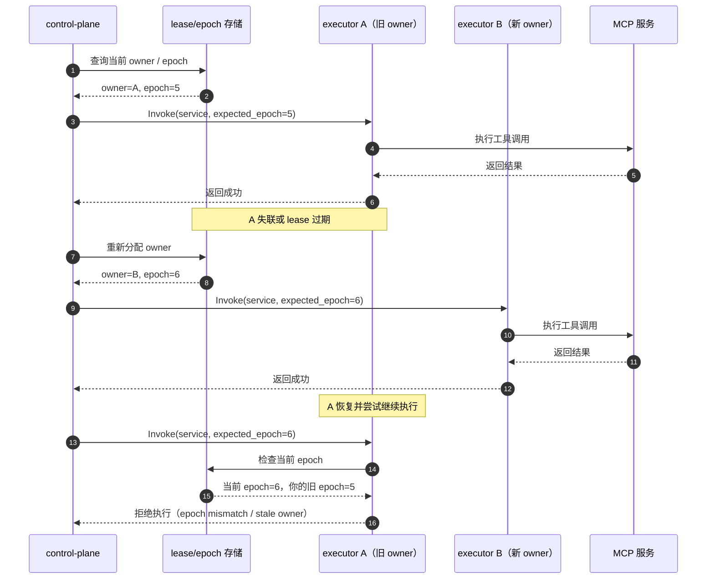

# V1.4B 入门说明：idle reaper 与 lease / epoch / fencing

> 面向初学者的通俗解释文档。
> 目标：解释这两个能力的原理、使用场景、案例，并结合本项目的 `control-plane / executor` 结构展示时序图。

---

# 1. 先看本项目结构

在本项目的双角色模式里，可以先把系统理解成：

- **control-plane**：前台、调度台，负责登录、服务管理、对外 API、调度请求
- **executor**：真正干活的一侧，负责持有 MCP 长连接、执行 `connect / list tools / invoke`
- **all**：单体回退模式，一个进程里同时承担 control-plane 和 executor 的职责

## 一句话记忆

- `control-plane`：前台 + 调度台
- `executor`：执行端 + 连接持有者
- `all`：小店模式，前台后厨在一起

## 结构图

```text
                +----------------------+
                |   用户 / 前端 / API   |
                +----------+-----------+
                           |
                           v
                +----------------------+
                |    control-plane     |
                |----------------------|
                | 1. 登录/鉴权          |
                | 2. 服务 CRUD         |
                | 3. 对外 HTTP API     |
                | 4. 调度请求           |
                +----------+-----------+
                           |
                           | 内部 RPC
                           v
                +----------------------+
                |      executor        |
                |----------------------|
                | 1. 持有 MCP 长连接    |
                | 2. connect/list      |
                | 3. invoke 工具       |
                | 4. 维护运行态         |
                +----------+-----------+
                           |
                           v
                +----------------------+
                |      MCP 服务         |
                +----------------------+
```

项目当前已具备的基础包括：

- role-aware 模式：`all / control-plane / executor`
- 最小内部 RPC：`connect / disconnect / list-tools / invoke / status / ping`
- V1.4A 已落地：并发限制、限流、async invoke、任务取消/查询、async sink

V1.4B 讨论的是两类增强能力：

1. **idle reaper**：自动回收长期空闲连接
2. **lease / epoch / fencing**：防止旧 owner 在切换后继续乱操作

---

# 2. idle reaper 是什么

## 2.1 通俗定义

idle reaper 可以理解成：

> **自动清理长期没人使用的连接，避免一直占资源。**

它解决的问题不是“谁有资格操作”，而是：

> “这个连接已经很久没人用了，还要不要继续保留？”

---

## 2.2 生活类比

### 例子：会议室自动关灯

- 会议室刚刚有人在用
- 后来人都走了
- 30 分钟都没人再进来
- 系统自动关灯、关空调、锁门

这就是 idle reaper 的思想：

- **有人在用** → 不能关
- **很久没人用** → 可以回收

也可以记成：

```text
有人开会  -------->  会议室要保留
没人开会很久 ----->  自动关灯、关空调、锁门
```

---

## 2.3 它依赖哪些信息

在本项目里，idle reaper 未来如果正式实现，最核心会看三样：

```text
1. LastUsedAt   = 最后一次真实业务使用时间
2. InFlight     = 当前有没有请求正在执行
3. idle_timeout = 空闲多久才允许回收
```

### 简化判断逻辑

```text
如果：
1. 没有请求在执行（InFlight == 0）
2. 距离最后使用已经超过 idle_timeout
3. 当前明确开启了空闲回收
那么：
=> 可以断开连接
```

---

## 2.4 为什么不能只看“最后一次心跳”

因为心跳（比如 ping）只说明：

> “这个进程还活着”

不代表：

> “这个连接最近真的被业务使用过”

所以更合理的语义是：

- `真实业务调用` 才刷新 `LastUsedAt`
- `Ping`、探活不刷新 `LastUsedAt`

否则就会出现：

```text
明明没人用
但因为健康检查一直在跑
连接永远不回收
```

---

## 2.5 在本项目里的位置

在本项目双角色模式里，通常是 **executor 持有真实 MCP 长连接**，所以 idle reaper 主要发生在 executor 这一侧。

```text
control-plane  --(RPC)-->  executor  --(长连接)-->  MCP 服务
                             ^
                             |
                      idle reaper 主要在这里判断
```

因为真正的 MCP 长连接在 executor 上，control-plane 只是发管理/执行请求，不直接长期持有 MCP 连接。

---

## 2.6 大图：idle reaper 判断流程

```text
                     +----------------------------------+
                     |        executor 持有 MCP 连接      |
                     +----------------+-----------------+
                                      |
                                      v
                     +----------------------------------+
                     | 现在有请求正在执行吗？            |
                     | InFlight > 0 ?                   |
                     +---------------+------------------+
                                     |
                       +-------------+-------------+
                       |                           |
                      是                           否
                       |                           |
                       v                           v
        +-----------------------------+   +-----------------------------+
        | 不能回收                     |   | 距离 LastUsedAt 太久了吗？   |
        | 因为还有任务在跑             |   | now - LastUsedAt > timeout? |
        +-----------------------------+   +-------------+---------------+
                                                        |
                                      +-----------------+----------------+
                                      |                                  |
                                     否                                  是
                                      |                                  |
                                      v                                  v
                      +-------------------------------+   +--------------------------------+
                      | 先保留连接                     |   | 允许进入回收候选                |
                      | 因为最近还用过                 |   | 可以执行 disconnect / close     |
                      +-------------------------------+   +--------------------------------+
```

---

## 2.7 idle reaper 时序图（结合本项目）



---

## 2.8 使用场景

### 适合实现 idle reaper 的场景

1. **连接很多，但大多数很少用**
   - 比如系统管理很多 MCP 服务
   - 有些服务一小时才调一次

2. **机器资源比较紧张**
   - 长连接多，吃内存、会话、连接资源

3. **下游服务不适合长期保活**
   - 长时间空闲连接容易变脏或失效

---

## 2.9 案例

### 案例 1：适合回收

```text
10:00 建立连接
10:05 调用一次工具
10:06 以后没人再用
idle_timeout = 30 分钟
10:40 巡检时发现：
- InFlight = 0
- 距离 LastUsedAt 超过 30 分钟
=> 可以回收
```

### 案例 2：不能误杀

```text
10:00 开始执行长任务
10:20 任务还没完成
虽然这段时间没有新请求
但 InFlight = 1
=> 不能回收
```

### 案例 3：不能被 Ping 干扰

```text
系统每 10 秒做一次健康检查 Ping
如果 Ping 也刷新 LastUsedAt
那么连接永远不会被回收
=> 所以 Ping 不应该算真实业务使用
```

---

## 2.10 优点与风险

### 优点

```text
[优点]
- 释放长期空闲资源
- 减少无意义长连接
- 让连接生命周期更可控
```

### 风险

```text
[风险]
- 误伤刚要复用的连接
- 断开后下次请求要重连
- 规则不严谨时，排查会变复杂
```

---

# 3. lease / epoch / fencing 是什么

这三个词经常一起出现，因为它们解决的是同一类问题：

> **如何确保“当前真正的 owner”才有资格继续执行和写状态。**

这里的“owner”你可以理解成：

> 当前负责某个服务运行态的那个执行者。

在本项目里，通常就是某个 executor（或某个被认为是当前执行 owner 的节点）。

---

## 3.1 最通俗的类比

### 类比：仓库管理员交接钥匙

```text
A 原来是仓库管理员
后来 B 接班
A 手上可能还有旧钥匙
但是门锁已经换成新版本
A 的旧钥匙再也打不开门
```

这就是 fencing 的核心思想：

> **旧主人就算还活着，也不能继续进去操作。**

---

## 3.2 先拆开理解

## lease（租约）

lease 可以理解成：

> **一张有时效的操作许可证。**

谁拿到 lease，谁就暂时是主人；超时了，资格就失效。

### 生活例子

像停车位月卡：

- 在有效期内，你能进场
- 过期了，你就没资格继续占位

---

## 3.3 epoch（版本号）

epoch 可以理解成：

> **“当前主人是第几代”的编号。**

例如：

- A 当 owner：epoch = 5
- 后来切给 B：epoch = 6

这样系统就知道：

- 现在最新主人是谁
- 老主人是不是已经过期

---

## 3.4 fencing（栅栏）

fencing 可以理解成：

> **即使旧主人还活着，也必须把它挡在门外。**

也就是说：

- A 曾经是 owner
- 后来 B 接管了
- A 网络恢复后还想继续执行
- 系统一看：A 带的是旧 epoch
- 直接拒绝

这个“拒绝旧主人继续干活”的动作，就是 fencing。

---

## 3.5 为什么 lease 不够，还要 fencing

因为现实里常见一个坑：

```text
A 的 lease 其实已经过期
但 A 自己不知道
A 还在继续执行请求
B 已经拿到新 lease，开始接管
=> A/B 同时操作
```

如果没有 fencing：

- 理论上 B 已经接管
- 实际上 A 还可能继续写
- 最后就变成“双主冲突”

所以：

```text
lease 决定“谁应该是主人”
epoch 决定“你是不是旧版本主人”
fencing 决定“旧主人不能继续干”
```

---

## 3.6 在本项目里的位置

结合本项目的 `control-plane / executor` 结构，最容易出问题的场景通常是：

- 某个服务原本由 executor A 负责
- 后来切换给 executor B
- A 恢复后还以为自己能继续操作

此时就需要：

- lease：表示当前 owner 是谁
- epoch：表示 owner 的代数
- fencing：旧 owner 再来操作时直接拒绝

### 简图

```text
control-plane
   |
   +----> executor A  (旧 owner, epoch=5)
   |
   +----> executor B  (新 owner, epoch=6)

如果没有 fencing：
A 和 B 可能都在操作同一个服务

如果有 fencing：
A 的旧 epoch 会被拒绝，只允许 B 继续执行
```

---

## 3.7 大图：三者怎么配合

```text
                  +----------------------+
                  |   lease（租约）       |
                  | 谁当前拥有操作资格     |
                  +----------+-----------+
                             |
                             v
                  +----------------------+
                  |   epoch（版本号）     |
                  | 当前 owner 是第几代   |
                  +----------+-----------+
                             |
                             v
                  +----------------------+
                  | fencing（栅栏）       |
                  | 旧 owner 一律拦住     |
                  +----------------------+
```

换成一句话：

```text
lease 决定“谁应该是主人”
epoch 决定“你是不是旧版本主人”
fencing 决定“旧主人不能继续干”
```

---

## 3.8 大图：切主前后发生了什么

```text
[阶段 1] 正常时期

control-plane ---> executor A ---> MCP 服务
                    (owner, epoch=5)


[阶段 2] A 失联或 lease 过期

control-plane ---> 重新选主 ---> executor B
                                 (owner, epoch=6)


[阶段 3] A 恢复

A 说：我也能继续执行！
系统检查：
- 当前最新 epoch = 6
- A 手里的还是旧 epoch = 5
=> 拒绝 A
=> 只允许 B 继续执行
```

---

## 3.9 lease / epoch / fencing 切主时序图（结合本项目）



---

## 3.10 使用场景

### 适合实现 lease / epoch / fencing 的场景

1. **同一服务只能有一个真实执行 owner**
   - 否则状态可能冲突

2. **存在切主/灰度/回切过程**
   - 比如 dual-role、主备切换、executor 重启切换

3. **旧节点恢复后可能继续写状态或继续执行**
   - 这类问题在分布式系统里很典型

---

## 3.11 案例

### 案例 1：没有 fencing 的坏结果

```text
A 原本是 owner
网络抖动后，系统把 owner 切给 B
B 开始处理请求
A 又恢复了，也继续处理请求
=> 两个 executor 同时操作同一个服务
=> 状态可能被覆盖，调用可能重复
```

### 案例 2：有 fencing 的正确结果

```text
A 原来 epoch=10
B 接管后 epoch=11
A 恢复时还拿着旧 epoch=10
系统一检查：你已经不是当前 owner
=> 拒绝 A
=> 只有 B 能继续执行
```

### 案例 3：不仅执行要拦，写状态也要拦

```text
B 已经是新 owner
A 虽然不能执行工具
但如果还能更新状态快照
状态页也会被旧信息污染
=> 所以 fencing 往往还要保护状态写入
```

---

## 3.12 优点与风险

### 优点

```text
[优点]
- 防止旧 owner 继续执行
- 降低双主/脑裂风险
- 让切主更安全
```

### 风险

```text
[风险]
- 机制复杂很多
- 需要可靠的 lease/epoch 存储
- 会影响调用链、状态链、回退逻辑、测试矩阵
```

---

# 4. 这两个概念的区别

```text
+----------------------+--------------------------------+--------------------------------+
| 对比项               | idle reaper                   | lease / epoch / fencing       |
+----------------------+--------------------------------+--------------------------------+
| 解决的问题           | 长期空闲连接占资源            | 旧 owner 继续乱操作           |
| 核心问题             | 还要不要留着这个连接？        | 你还有没有资格继续操作？       |
| 主要看什么           | LastUsedAt / InFlight         | owner / lease / epoch         |
| 典型动作             | 自动断开空闲连接              | 拒绝旧 owner 请求              |
| 复杂度               | 中等                           | 高                              |
+----------------------+--------------------------------+--------------------------------+
```

---

# 5. 结合当前项目现状，为什么它们被放到 V1.4B

## 5.1 idle reaper

当前项目已经有一些“地基”：

- `LastUsedAt`
- `InFlight`
- `runtime.idle_timeout`

但还没完整做：

- reaper worker
- 候选判定日志
- 自动断开逻辑
- 完整误杀保护验证

所以它更像：

```text
地基已经有了
但房子还没正式盖
```

---

## 5.2 lease / epoch / fencing

当前项目只有一部分协议预留，比如：

- RPC 里的 `ExpectedEpoch`

但还没完整做：

- lease 获取 / 续约 / 释放
- epoch 递增
- stale owner 拒绝执行
- stale owner 拒绝写状态
- 相关观测和测试闭环

所以它更像：

```text
不仅房子没盖
连主体钢结构都还没装完
```

---

# 6. 给初学者的最终记忆法

## idle reaper = 清场保安

它问：

> “这间房很久没人用了，要不要清场？”

---

## lease / epoch / fencing = 门禁保安

它问：

> “你是不是当前值班的人？不是就别进。”

---

# 7. 最后一页总结

```text
idle reaper
= 解决“没人用了还占资源”
= 重点在连接生命周期管理

lease / epoch / fencing
= 解决“不是当前主人还在乱操作”
= 重点在执行所有权一致性
```

在本项目里：

```text
control-plane 负责调度和 API
executor 负责真实执行和长连接

所以：
- idle reaper 更偏 executor 侧连接管理
- lease / fencing 更偏双角色切主时的一致性保护
```

---

## 8. 延伸阅读

- `docs/architecture-upgrade-plan.md`
- `docs/architecture-upgrade-iteration-breakdown.md`
- `internal/rpc/types.go`
- `internal/mcpclient/managed_client.go`
